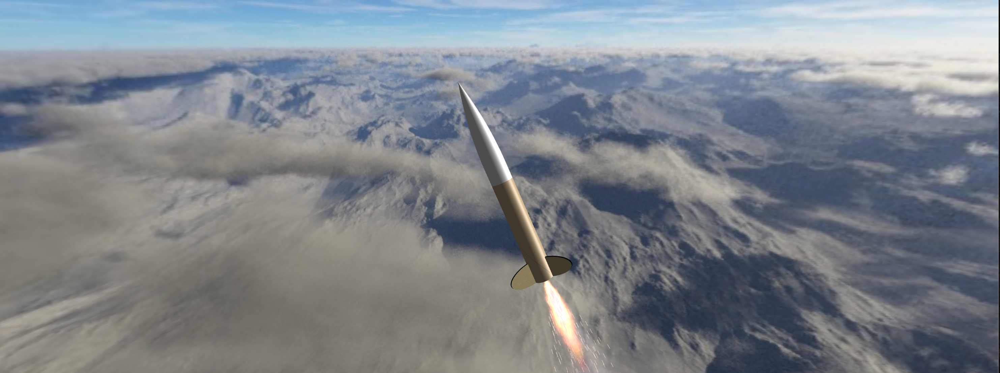

# Rocket Design and Simulation

A comprehensive rocket development project that demonstrates the complete process from initial design through simulation, hardware implementation, and data validation.

## Project Overview

This repository showcases the iterative process of rocket design by integrating three key components:

1. OpenRocket modeling - Initial design, simulation, and optimization using industry-standard software
2. Custom Python Simulation - Physics-based simulation with transonic drag accounted for, made from base principles
3. ESP32 Data Acquisition - Real-world flight data collection for model validation

The goal is to demonstrate how theoretical predications compare with actual flight data.
